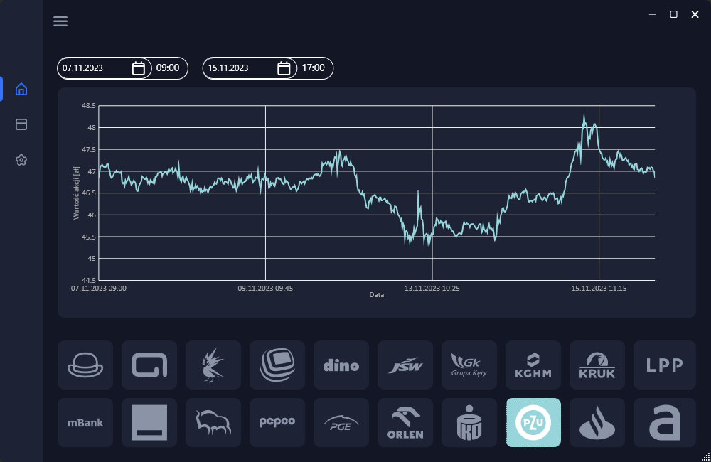
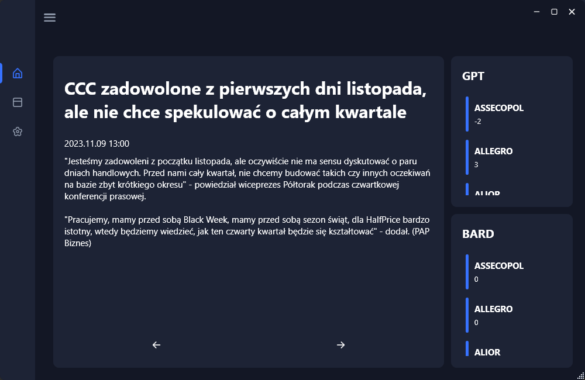
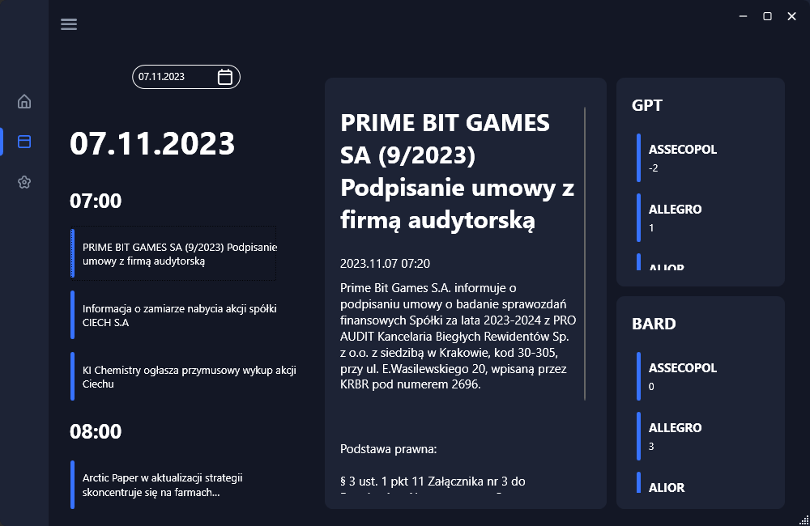
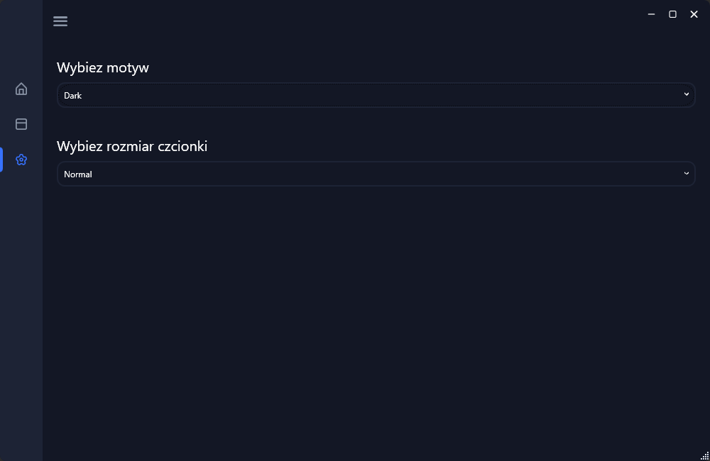
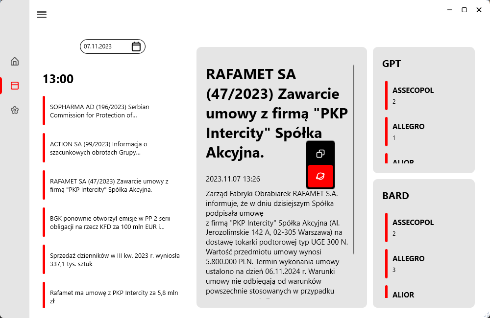
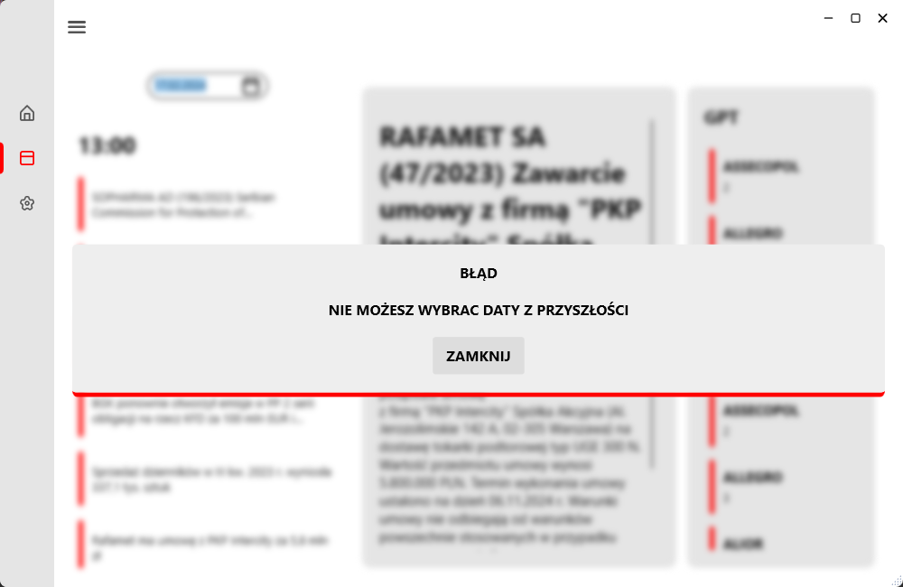

# Inwestuj Roztropnie - Application Description
## Overview
Inwestuj Roztropnie is an advanced analytical application that leverages the latest data from the PAP Biznes website, a leading Polish business portal providing up-to-date news, analyses, and reports on the economic, financial, and business situation in Poland. The application uses cutting-edge machine learning algorithms (LLM) to forecast changes in the values of the largest stock companies in Poland. By analyzing historical trends and current events, it delivers precise predictions on future stock values to users.

### Main View

The application boasts a modern and intuitive interface, offering investors, financial analysts, and less experienced users quick access to key information. The main screen features a prominent, clear chart displaying stock values in Polish złoty.

### Chart Interaction
Users can interact with the chart by clicking on logos representing major Polish companies. Clicking on any logo immediately updates the chart to display the company's stock value over time. Selecting multiple companies simultaneously shows the percentage change in stock prices starting from 100% relative to the first date chosen on the calendar above the chart.

An innovative feature allows users to click on any point on the chart, seamlessly transitioning to an article published at that precise time.

### Article View (after click on the chart)

Upon entering the article view, users will find predictions for the stock values of all companies generated by Chat GPT and Google Barda. These predictions are retrieved from our extensive database.

Two arrow buttons beneath the article facilitate efficient navigation between the next and previous articles chronologically.

### Articles View (section)

The application provides a list of all previously gathered articles. Clicking on the calendar allows users to smoothly navigate to a specific date and search for a desired headline. If our database lacks articles of interest, users can select any date in the calendar to retrieve all article headlines. After selecting a specific article, the content along with language model analysis will be fetched.

### Settings

Users can choose between dark, light, and high-contrast themes suitable for visually impaired clients. Additionally, font size adjustments cater to individual preferences for legible text.

### Additional Features

Beyond the basics of copying article text, Inwestuj Roztropnie allows users to open the default browser directly from the app for further analysis. Users can also copy Chat GPT and Google Barda ratings and refresh the GPT rating.

### Exception handling

In the event of accidental clicks on future dates or interrupted internet connectivity during chatGPT queries or article loading, users will receive informative notifications. The application remains operational with an expanding offline database.

## Installation Instructions
1. Download the latest version of the application from the "Code" tab on the project website.
2. Open the downloaded .zip file and extract its contents.
3. Go to the PzykladWPF\projektIOv2\bin\Debug\net6.0-windows directory, where the .exe file is located.
4. Run the [projektIOv2.exe] file.
